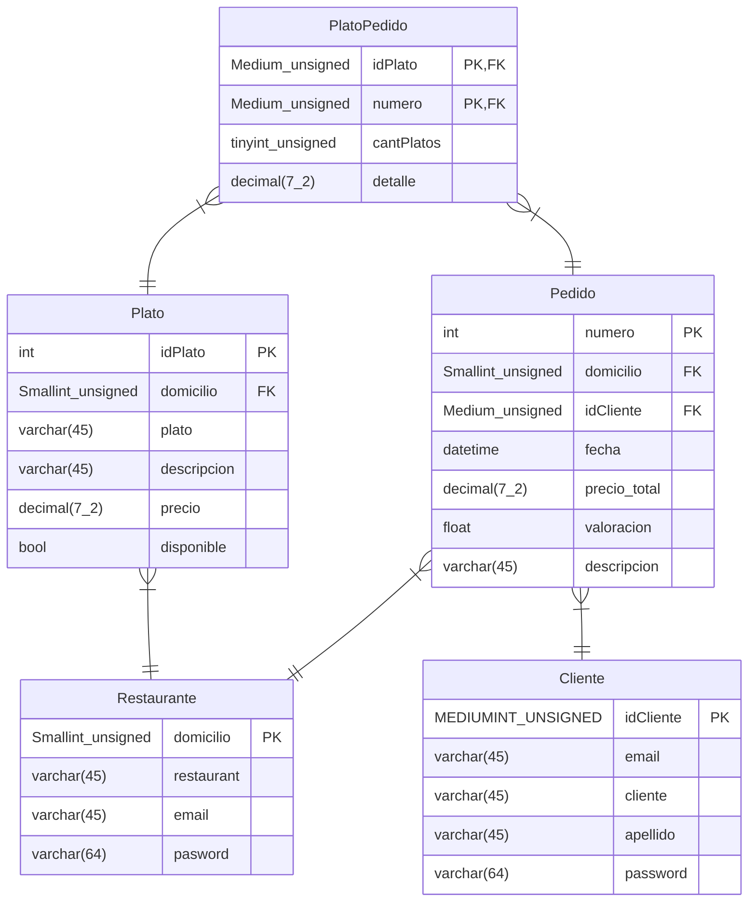

```mermaid
erDiagram
    Restaurante{
        Smallint_unsigned  domicilio PK
        varchar(45) restaurant
        varchar(45) email
        varchar(64) pasword

    }
    Plato{
        int idPlato PK
        Smallint_unsigned domicilio FK
        varchar(45) plato
        varchar(45) descripcion
        decimal(7_2) precio
        bool disponible
    }   
    Cliente{
        MEDIUMINT_UNSIGNED idCliente PK
        varchar(45) email 
        varchar(45) cliente
        varchar(45) apellido
        varchar(64) password
    }
    Pedido{
        int numero PK
        Smallint_unsigned domicilio FK
        Medium_unsigned idCliente FK
        datetime fecha
        decimal(7_2) precio_total 
        float valoracion 
        varchar(45) descripcion
    }
    PlatoPedido{
        Medium_unsigned idPlato PK,FK
        Medium_unsigned numero PK,FK
        tinyint_unsigned cantPlatos
        decimal(7_2) detalle 
    }
    Plato }|--|| Restaurante : ""
    Pedido }|--|| Restaurante : ""
    PlatoPedido }|--|| Plato : ""
    PlatoPedido }|--|| Pedido : ""
    Pedido }|--|| Cliente : ""
```