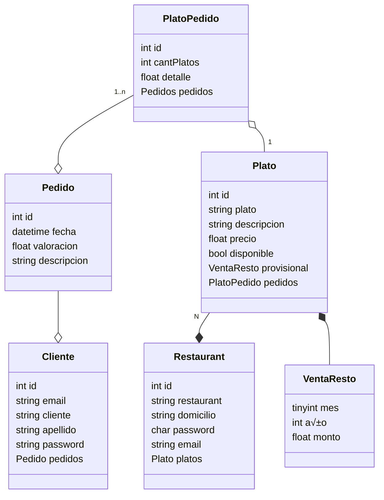

```mermaid
classDiagram
    class Restaurant {
        int id
        string restaurant
        string domicilio
        char password
        string email 
        Plato platos
    }
    class Plato{
        int id
        string plato
        string descripcion
        float precio
        bool disponible
        VentaResto provisional
        PlatoPedido pedidos
    }
    class Cliente{
        int id
        string email
        string cliente
        string apellido
        string password
        Pedido pedidos
    }
    class Pedido{
        int id
        datetime fecha
        float valoracion
        string descripcion
    }
    class PlatoPedido{
        int id
        int cantPlatos
        float detalle
        Pedidos pedidos
    }
    class VentaResto{
        tinyint mes
        int año
        float monto
    }
    Pedido --o Cliente
    PlatoPedido "1..n" --o Pedido 
    PlatoPedido o-- "1" Plato
    Plato "N" --* Restaurant
    Plato *-- VentaResto
```
